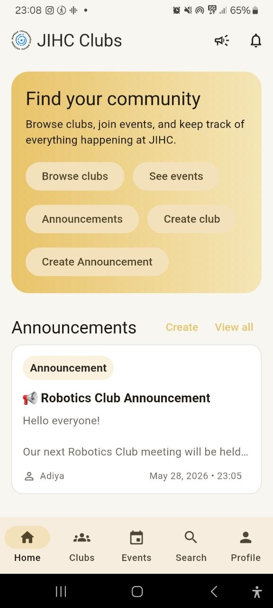
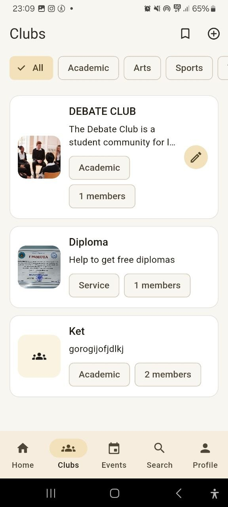
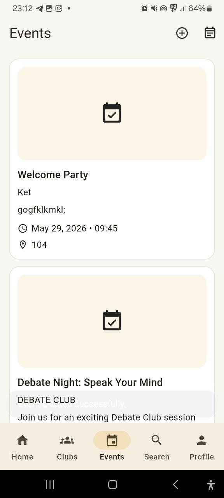
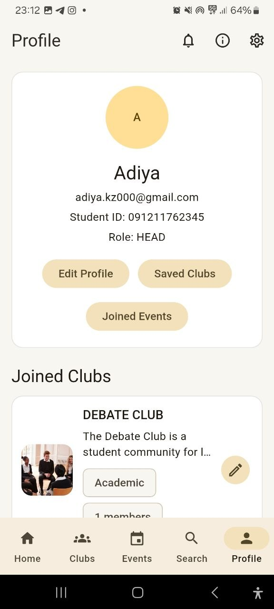

# JIHC Clubs

**Developer:** Dosmakhanbet Altynay  
**Student ID:** 091211654123

JIHC Clubs is a Flutter + Firebase mobile app for discovering school clubs, joining communities, managing events, and staying updated with announcements at JIHC.

## Features

- Email/password authentication
- Google Sign-In
- Forgot password flow
- Role-based registration: `member` and `head`
- Real-time club, event, and announcement feeds with Firestore snapshots
- Club join/leave and event RSVP
- Head-only club and event CRUD
- Firebase Storage uploads for profile, club, and event images
- Saved clubs and joined events tracking
- Responsive Material 3 interface with the golden accent color `#E9C46A`

## Tech Stack

- Flutter
- Firebase Auth
- Cloud Firestore
- Firebase Storage
- flutter_riverpod
- go_router

## Firestore Structure

### `users/{uid}`

```json
{
  "uid": "firebase-auth-uid",
  "fullName": "Student Name",
  "email": "student@example.com",
  "studentId": "091211654123",
  "role": "member",
  "profileImage": "https://...",
  "joinedClubs": ["clubId1"],
  "savedClubs": ["clubId2"]
}
```

### `clubs/{clubId}`

```json
{
  "name": "Robotics Club",
  "description": "Build and compete with robots.",
  "category": "Technology",
  "photoURL": "https://...",
  "adminUid": "creatorUid",
  "memberCount": 12,
  "memberUids": ["uid1", "uid2"],
  "createdAt": "timestamp"
}
```

### `events/{eventId}`

```json
{
  "clubId": "clubId1",
  "clubName": "Robotics Club",
  "title": "Workshop Day",
  "description": "Intro to Arduino",
  "date": "timestamp",
  "location": "Room 204",
  "photoURL": "https://...",
  "attendeeUids": ["uid1"],
  "createdBy": "creatorUid",
  "createdAt": "timestamp"
}
```

### `announcements/{announcementId}`

```json
{
  "clubId": "clubId1",
  "clubName": "Robotics Club",
  "title": "Meeting Update",
  "description": "The meeting starts at 4 PM.",
  "createdBy": "creatorUid",
  "createdAt": "timestamp"
}
```

## Screen Coverage

- Splash
- Onboarding 1-3
- Login
- Register
- Forgot Password
- Home
- Clubs
- Club Details
- Create Club
- Edit Club
- Events
- Event Details
- Create Event
- Edit Event
- Search
- Notifications
- Profile
- Edit Profile
- Settings
- About
- My Clubs
- Saved Clubs
- Members
- Joined Events
- Announcements

## Setup Instructions

1. Install Flutter and a supported device emulator.
2. Create a Firebase project.
3. Enable:
   - Authentication: Email/Password and Google
   - Cloud Firestore
   - Firebase Storage
4. Add Firebase config files:
   - `android/app/google-services.json`
   - `ios/Runner/GoogleService-Info.plist`
5. Install packages:

```bash
flutter pub get
```

6. Apply Firestore rules from `firestore.rules`.
7. Run the app:

```bash
flutter run
```

## Screenshots

### Home Screen


### Clubs Screen


### Events Screen


### Profile Screen


## Notes

- Heads can create, edit, and delete only their own clubs and events.
- Members can browse clubs, join clubs, save clubs, and RSVP to events.
- The app uses Firebase Auth UID as the Firestore document ID.
